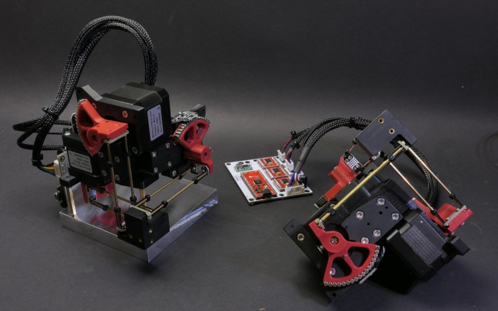
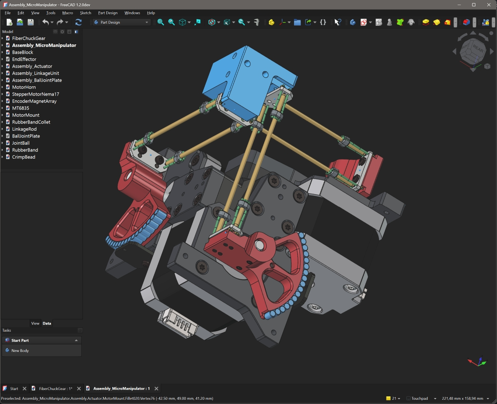
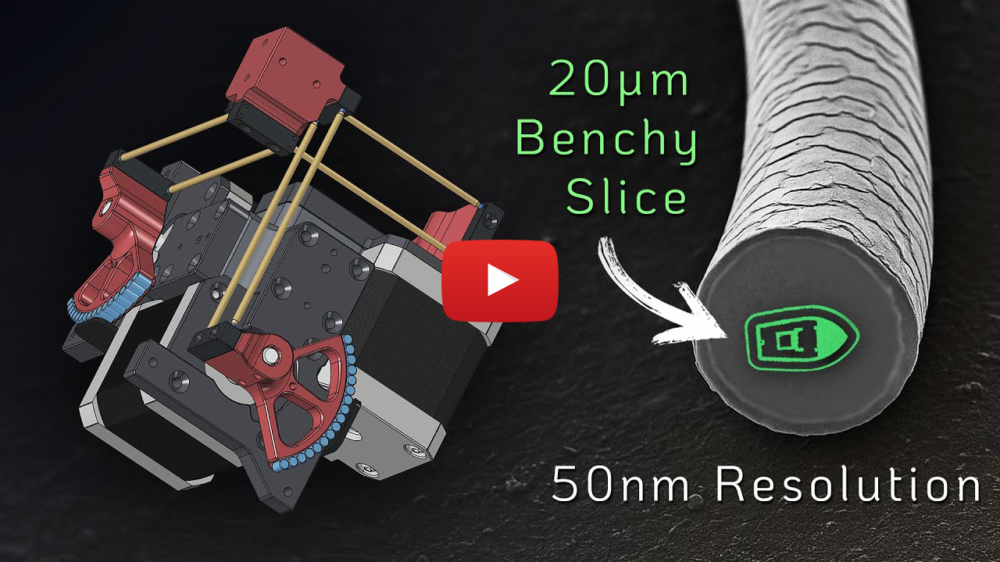
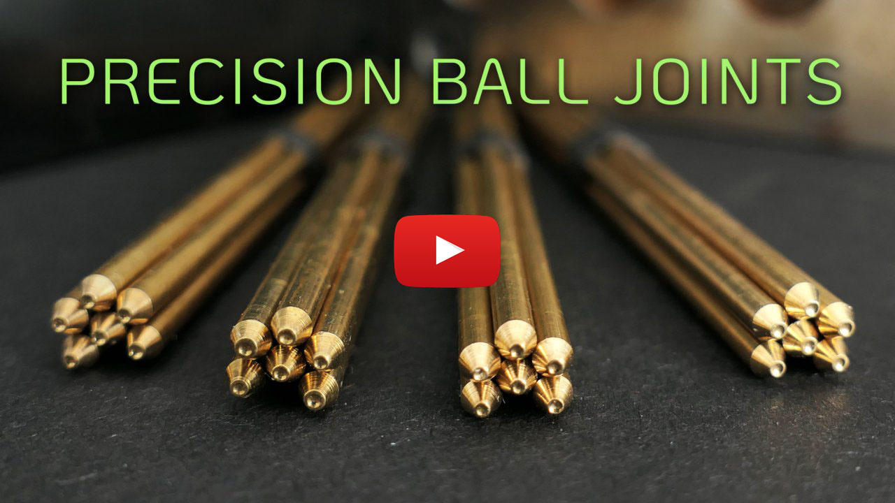

# Open Micro-Manipulator

This project contains an open source low-cost, easy-to-build motorized **XYZ Micro-Manipulator** motion control platform achieving submicron precision.
It's designed for applications such as optical alignment, probing electronic components, and microscopy.

Check out the YouTube video for more information about the device and how it is built:<br>
[An Open Source Motorized XYZ Micro-Manipulator - Affordable sub µm Motion Control](https://youtu.be/MgQbPdiuUTw)

<div style="display: flex; gap: 2%;">
  
  
</div>

Thanks to its parallel kinematic structure and miniature ball joints, it achieves good mechanical stiffness and a large range of motion.
The motors are off the shelf stepper motors dr​iven by a 30 kHz closed loop controller and a very precise PWM signal.
A 'magnetic gearing' approach increases the resolution of the low-cost magnetic rotary encoders by a factor of 30 allowing for steps down to 50nm
(**Please mind the difference between resolution and accuracy**. The absolute accuracy is significantly worse.

The device can be controlled via simple G-Code commands over a USB serial interface and is thus easily integrated into other projects.
The firmware implements a complete motion planning stack with look-ahead for smooth and accurate path following capabilities.

## Getting Started

Below is a list of high level steps you can follow if you want to replicate the project. 
If you have questions or problems with the build or just want to discuss subjects related to the project, 
joint the projects community [Discord Server](https://discord.gg/maRvMVpa2Q).

1. Read this Document and watch the linked videos
2. Get the parts listed in [Bill of Materials](documentation/bom/bom.md)
3. Build the device and electronics
4. Change the hardware configuration according to your build [hw_config.h](firmware/MotionControllerRP/src/hw_config.h)
5. Upload firmware using VSCode with PlattformIO plugin
6. Calibrate axis

Also check out the setup guide for new devices: [Setup Guide](documentation/setup_guide/setup_guide.md)

## ✨NEW: Hardware Version 4.0
A new version of the hardware has been released, fixing several issues with the previous design:

- Self collision during homing fixed.
- Connection of ball joint block with screws only was not well constrained and could rotated a bit.
- No reliable way to ensure consistent linkage rod length
- Unnecessary ball joint friction
- Accurate ball position heavily dependet on print quality and corner rounding
- Rubber bands could not be changed or removed once glued in.

A video about the improved ball joint and linkage manufactoring process can be found on YouTube: [Better Ball Joints for the Open Micro-Manipulator](https://www.youtube.com/watch?v=NM2KXvRGmpg)
Also the FreeCAD model was restructured and improved and now includes all pins and fasteners. It now provides a reference for all required mechanical parts. 

<div style="display: flex;">
    
</div>

WARNING: BOM is not updated yet...

## Open Micro-Manipulator GUI
To make testing and using the Open-Micro Manipulator easy and convenient a python control program with a graphical user interface is provided here: [Open Micro-Manipulator GUI](https://github.com/0x23/OpenMicroManipulatorGUI).
It has simple controlls to move the device around, while also displaying a live camera feed (e.g. from a microscope camera). Additional features, include a simple g-code runner and realtime mouse control (e.g. for Biology applications).

<div style="display: flex;">
    
</div>

## 🐍 Python-API

The lightweight Python API handles all serial communication and provides convenient command execution and debug message printing.
The interface includes functions to home, move, and calibrate the device, as well as to query device information.
Simply copy the [open_micro_stage_api.py](software/PythonAPI/open_micro_stage_api.py) file into your project (also install the dependencies in requirements.txt), and you’re ready to get started.

## Usage Example
```python
from open_micro_stage_api import OpenMicroStageInterface

# create interface and connect
oms = OpenMicroStageInterface(show_communication=True, show_log_messages=True)
oms.connect('/dev/ttyACM0')

# run this once to calibrate joints
# for i in range(3): oms.calibrate_joint(i, save_result=True)

# home device
oms.home()

# move to several x,y,z positions [mm]
oms.move_to(0.0, 0.0, 0.0, f=10)
oms.move_to(3.1, 4.1, 5.9, f=26)
oms.move_to(0.0001, 0.0, 0.0, f=10)

# wait for moves to finish
oms.wait_for_stop()
```

## API Functions (most relevant functions only)
```python
connect(port, baud_rate=921600)
disconnect()
set_workspace_transform(transform)
get_workspace_transform()
home(axis_list=None)
calibrate_joint(joint_index, save_result)
move_to(x, y, z, f, move_immediately, blocking, timeout)
set_tool_output(tool_idx, output_value, immediate)
set_pose(x, y, z)
dwell(time_s, blocking, timeout)
enable_motors(enable)
wait_for_stop(polling_interval_ms, disable_callbacks)
set_max_acceleration(linear_accel, angular_accel)
set_servo_parameter(pos_kp, pos_ki, vel_kp, vel_ki, vel_filter_tc)
```
## ✨ Firmware v1.0.4

Firmware 1.0.4 comes with many smaller improvements and bugfixes and a great new feature as well:

 - **Tools**: Tool usage (for example for laser engraving) is now supported on the two GPIO pins of J5 on the pcb.
              Tools are integrated into the planner and run fast and with correct timing when executing g-code.
              The tools support PWM (using the PIO feature to squeeze out extra channels without relying on software PWM).

   Example usage:
   ```
     M3 T0 S0.7  // set pwm output of tool 0 to 70%
     G4 S0.001   // dwell command (or any other motion command) - necessary to apply the tools output
   ```
   
- **Calibration**: Calibration has now some addition error checks to improve error reporting of potential problems like encoder alignment.
- **Kinematic Model Parameter**: Initialization code has been cleaned up and better comments where added to the parameters. Parameters are preset for HW v4.0 but you can toggle back to the old HW-v3.0 parameters if necessary.
- **Bugfixes**: smaller bugfixes

IMPORTANT: If you have **Hardware Version v3.0** you need to switch back to the old kinematic parameters in the [kinematic_model_delta3d.cpp](firmware/MotionControllerRP/src/kinematic_models/kinematic_model_delta3d.cpp) file (there is an #define for that at the top).

## Firmware v1.0.1

This update improves calibration, homing, logging, and adds several new G-Code commands.

### Improvements
- **Homing**: parallel homing support, higher repeatability, more accurate geometric reference  
- **Joint calibration**: refined procedure, persistent flash storage (no recalibration after reboot)  
- **Logging**: clearer and more detailed output  

### New G-Code Commands
- `G28` — Home joints (supports homing multiple axis simultanously for faster startup)
- `G24` — Set pose command (directly sets servo targets, bypassing motion controller)  
- `M17/M18` — Enable/Disable motors (with pose recovery from encoders on enable)  
- `M51` — Read encoder values  
- `M55` — Set servo loop parameters 
- `M56` — Joint calibration (with save-to-flash option)  
- `M57` — Read various information about the device state  
- `M58` — Read firmware version

## ⚙ CAD-Files

All CAD models are made in **FreeCAD** to​ allow everyone to view and modify the design without subscribing or paying for a proprietary CAD solution.
Note that most components are already designed with the goal to make them easily machinable on a 3-Axis CNC-Mill.
You can also 3D-Print the parts but have to live with thermal drift (carbon filled filaments can reduce this problem).

<div style="display: flex;">
    
</div>

<br>

The CAD files can be found here: [CAD Models](construction).
Please note that FreeCAD version **1.2.0dev** was used, and the files might not work with older versions.

STL files for printing can be found here: [STL Files](construction/STL_3D_Printing/)

## ⚙ Kinematic Model

The kinematic model is defined here: [kinematic_model_delta3d.cpp](firmware/MotionControllerRP/src/kinemtaic_models/kinematic_model_delta3d.cpp).
Please check the dimensions of your build against the values set in the constructor. In particular, make sure the arm length matches.

## ⚙ Electronics

IMPORTANT: If you fabricated PCB version v1.2 (see version label on the board) you need to drill out a misplaced via on diode D1 that shorts 5V rail to ground (See [repair image](electronics/pcb_v1.2_fix.jpg) ). The problem was fixed in v1.3.

The electronics are designed in **KiCAD** and only commonly available modules (motor drivers and MCU boards) are used and connected by a simple PCB. No SMD soldering is required to populate the board to make the build extra accessible.
For usual winding resistance of your motors, the device should be powered by $${\color{lightgreen} 5V-6V }$$ (2A) to keep current and heating to a reasonable level.

<div style="display: flex; gap: 5%;">
  
  
</div>

The repository now also contains the fabrication files that can be directly uploaded to the PCB manufacturer.

## ⚙ Firmware

The firmware is written in C++ and takes some inspiration from the 'SimpleFOC' project. It aims to be streamlined and readable without any extra fuss, focusing on the hardware used in this project.
It implements path planning with look-ahead and, unlike many other motion controller projects, supports true 6DOF-Pose interpolation and planning, making it ready for driving hexapod motion platforms; that may or may not be the next step for this project.

You may find configuration for pin numbers, motor type, and other parameters in [hw_config.h](firmware/MotionControllerRP/src/hw_config.h). Please check them before uploading the firmware.

<div style="display: flex; gap: 2%;">
  
  
</div>

### Building and Flashing the Firmware

For building and flashing the firmware, Visual Studio Code (available for free on Windows and Linux) is recommended.
Install the PlatformIO add-on and open the firmware folder. You can now build and flash the firmware like any other PlatformIO project.

## ⚙ G-Code Interface

The firmware supports only a small subset of G-Code commands listed below.  
Each command is acknowledged with either an **`ok`** or **`error`** response.  

If a command provides additional information (e.g., the *get position* command), that information is returned **before** the `ok` message.  
The client must wait for an acknowledgment from the previous command before sending the next one—otherwise, behavior is undefined.
| Command           | Description                                                                 |
|-------------------|-----------------------------------------------------------------------------|
| `G0 X Y Z F`   | Move the end-effector in a straight line to the specified position. <br>• `X`, `Y`, `Z`: target positions <br>• `F`: feed rate |
| `G1 X Y Z F`   | Same as `G0`.                                                              |
| `G4 S/P`       | Dwell/pause for a specified time. <br>• `S`: seconds <br>• `P`: milliseconds |
| `G24 X Y Z A B C` | Directly set current pose for servo loops with optional rotation vector* `A`, `B`, `C`. |
| `G28 A-F`      | Home one or more joints. <br>• Optional joint selection `A`–`F`.           |
| `M3`           | Set Tool output. <br>• `T`: tool index <br>• `S`: output value (0.0..1.0) <br> Note: new values is only applied on the next motion or dwell command         |
| `M17`          | Enable motors and read current pose as the start pose.                     |
| `M18`          | Disable motors.                                                            |
| `M50`          | Get current internal pose. (Encoders are not read here)                                   |
| `M51`          | Get current encoder angles (in degrees) and raw encoder values.              |
| `M52`          | Get the number of items in the planner queue.                               |
| `M53`          | Check if all planned moves are finished (`1` = finished, `0` = not finished). |
| `M55 A B C D F` | Set servo loop parameters. <br>• `A`, `B`: position PI controller gains (P and I) <br>• `C`, `D`: velocity PI controller gains (P and I) <br>• `F`: velocity filter time constant |
| `M56 J S`      | Calibrate a joint. <br>• `J`: joint index <br>• `S`: save calibration result |
| `M57`          | Get device and servo loop info: homing/calibration state, angles, loop frequencies, and file list. |
| `M58`          | Get firmware version.                                                      |
| `M204 L A`     | Set linear and angular acceleration. <br>• `L`: linear acceleration <br>• `A`: angular acceleration |

*Note: The communication protocol uses 3D vectors for rotations. The direction represents the rotation axis and the length of the vector represents the angle of rotation around the axis.

## ❤️ Support

If you'd like to support this project, consider the following:

- **Contribute to the build guide** – Help improve or expand the build instructions by submitting pull requests or opening issues with suggestions.
- **Characterize typical radial stepper motor shaft error motion** – Measure radial error motion of the shaft of multiple Nema-17 stepper motors (see Cylos Garage for more information about the subject: https://www.youtube.com/watch?v=gt2gK-oxy5s).
- **Give feedback on the build experience** – Let us know what worked, what didn’t, and how the process could be smoother for others.
- **Support the project on Ko-fi** – If you find this project valuable, you can support it financially via [Ko-fi](https://ko-fi.com/diffractionlimited) ☕.

## Youtube Video
[](https://youtu.be/MgQbPdiuUTw)
[](https://youtu.be/MgQbPdiuUTw)

