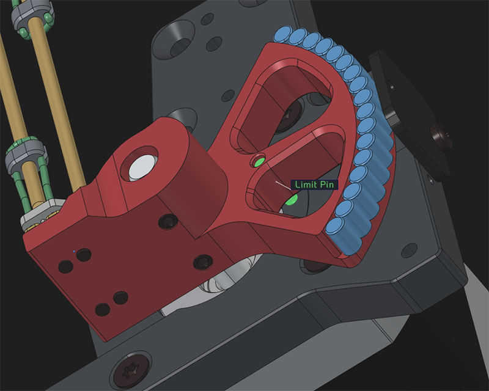
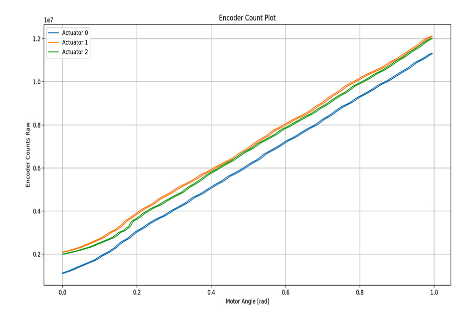
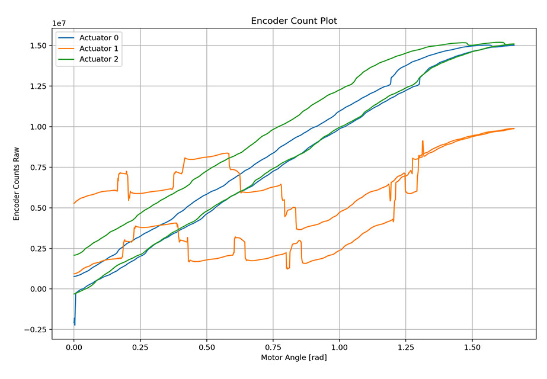

# Setup Guide

This guide walks you through the setup of your new **Open Micro-Manipulator** device.

## Checklist for New Devices

1. **Was the mechanical limit pin added to the rotor?**  
   This pin is required for proper homing of the device.

    

        
    

2. **Are the screws that secure the rotor to the motor shaft installed?**  
   If the rotor is not firmly attached, it may slip imperceptibly during homing or other movements, leading to problems during calibration and homing.

3. **Is the homing direction correct?**  
   During the homing command (`G28`), the end effector should move toward the base.  
   If it moves in the opposite direction, rewire the motor to reverse its direction.

## Calibration and Checking the Encoders

You can use the calibration plotter to check if your encoders are working as expected.
On the left you see a good calibration on the right a bad calibration.

|  |  |
:--:|:--:
| **Good calibration** | **Bad calibration** |

THIS DOCUMENT IS UNFINISHED AND WORK IN PROGRESS...
